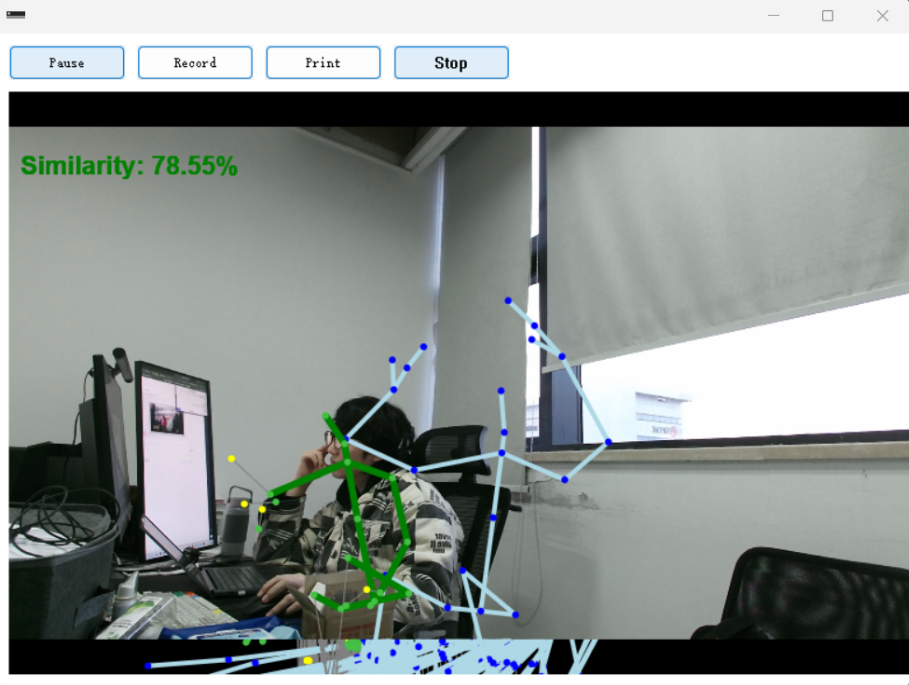

# G4-kinect_fitness - KFC
### SEU HCI2024 G4 

English version <a href="README_en.md">here</a>.

*Kinect Fitness Coach* 是一个基于 Kinect v2 的健身教练系统框架。简称 KFC (认真)。  
主命名空间为`kfc`。

默认编译环境为 Visual Studio 2022，使用 C++17 标准。  
依赖 Windows API 及 Kinect SDK v2，因此仅支持 Windows 8 及以上版本。



*学生作品，仅供娱乐。*

依赖
---

<a href="External/README.md">External位置</a>。

- 窗口：  Win32 API
- 日志库：[spdlog](https://github.com/gabime/spdlog)
- 数学库：[Eigen 3.4.0](https://eigen.tuxfamily.org/index.php?title=Main_Page)
- 绘图库：[Direct2D](https://docs.microsoft.com/en-us/windows/win32/direct2d/direct2d-portal)

文档
---

- [使用说明](docs/Usage.md) - 详细的使用指南，包含按键说明和配置文件说明
- [算法说明](docs/Algorithm.md) - 技术实现细节和算法原理

结构
---

```
G4-Kinect/
├── include/            # Header files
│   ├── core/          # Core functionality
│   │   ├── application.h
│   │   ├── common.h
│   │   └── utils.h
│   ├── ui/            # UI related
│   │   └── window.h
│   ├── calc/          # Calculation and algorithms
│   │   ├── compare.h
│   │   └── serialize.h
│   ├── log/           # Logging functionality
│   │   └── logger.h
│   └── config/        # Configuration
│       └── config.h
├── src/               # Source files
│   ├── core/          # Core implementation
│   │   ├── application.cpp
│   │   └── common.cpp
│   ├── ui/            # UI implementation
│   │   └── window.cpp
│   ├── calc/          # Algorithm implementation
│   │   ├── compare.cpp
│   │   └── serialize.cpp
│   ├── log/           # Logger implementation
│   │   └── logger.cpp
│   └── main.cpp       # Program entry
├── data/              # Data files
│   ├── config.toml    # Configuration file
│   └── standard/      # Standard action files
├── docs/              # Documentation
│   ├── Algorithm.md   # Algorithm details
│   └── Usage.md       # Usage guide
├── External/          # External dependencies
│   ├── Eigen/         # Eigen library
│   └── spdlog/        # Logging library
└── README.md          # This file
```

*release:*

```
G4-Kinect/
├── kinect_fitness.exe    # Main program
├── data/               # Data directory
│   ├── config.toml    # Configuration file
│   ├── standard/      # Standard action files directory
│   └── record/       # Recorded action files directory
└── README.md          # This file
```


